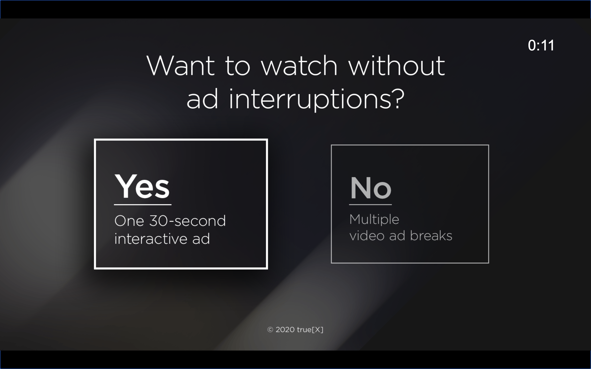

![true[X] logo](media/truex.png)

# TruexAdRenderer Web Documentation

Version 1.4.0

## Contents

* [Overview](#overview)
* [Product Flows](#product-flows)
* [How to use TruexAdRenderer](#how-to-use-truexadrenderer)
    * [When to show true\[X\]](#when-to-show-truex)
    * [Handling Events from TruexAdRenderer](#handling-events-from-truexadrenderer)
        * [Terminal Events](#terminal-events)
    * [Handling Ad Elimination](#handling-ad-elimination)
* [TruexAdRenderer Web API](#truexadrenderer-web-api)
    * [Installing true[X] Library](#installing-truex-library)
    * [`TruexAdRenderer` Input Events](#truexadrenderer-input-events)
        * [`init`](#init)
        * [`start`](#start)
        * [`stop`](#stop)
    * [`TruexAdRenderer` Output Events -- Main Flow](#truexadrenderer-output-events----main-flow)
        * [`adFetchCompleted`](#adfetchcompleted)
        * [`adStarted`](#adstarted)
        * [`adCompleted`](#adcompleted)
        * [`adError`](#aderror)
        * [`noAdsAvailable`](#noadsavailable)
        * [`adFreePod`](#adfreepod)
        * [`userCancelStream`](#usercancelstream)
    * [`TruexAdRenderer` Output Events -- Informative](#truexadrenderer-output-events----informative)
        * [`optIn`](#optin)
        * [`optOut`](#optout)
        * [`skipCardShown`](#skipcardshown)
        * [`userCancel`](#usercancel)

## Overview

In order to support interactive ads on HTML5-enabled smart TVs and game consoles, true[X] has created an npm package that can renderer true[X] ads and leverage your app's existing ad server and content delivery mechanism (e.g. SSAI).

With this library, the host player app can defer to the `TruexAdRenderer` when it is required to display a true[X] ad.

For simplicity, publisher implemented code will be referred to as "host app code" while true[X] implemented code will be referred to as "renderer code".

true[X] will provide an npm package: `@truex/ctv-ad-renderer` that can be added to your host app. This library will offer a class, `TruexAdRenderer`, that will need to be instantiated, initialized, and given certain commands (described below in [TruexAdRenderer Input Events](#truexadrenderer-input-events)) by the host app code.

At this point, the renderer code will take on the responsibility of requesting ads from true[X] server, creating the native UI for the true[X] choice card and interactive ad unit, as well as communicating events to the host app code when action is required.

The host app code will still need to parse out the ad response, detect when a true[X] ad is supposed to display, pause the stream, instantiate `TruexAdRenderer`, and handle any events emitted by the renderer code.

It will also need to handle skipping ads in the current ad pod, if it is notified to do so.


## Product Flows

There are two distinct product flows supported by `TruexAdRenderer`: Sponsored Stream (full-stream ad-replacement) and Sponsored Ad Break (mid-roll ad-replacement).

In a Sponsored Ad Break flow, once the user hits a mid-roll break with a true[X] tag flighted, they will be shown a "choice-card" offering them the choice between watching a normal set of video ads or a fully interactive true[X] ad:



_**Fig. A** example true[X] mid-roll choice card_

If the user opts for a normal ad break, or if the user does not make a selection before the countdown timer expires, the true[X] UI will close and playback of normal video ads can continue as usual.

If the user opts to interact with true[X], an interactive ad unit will be shown to the user:


_**Fig. B** example true[X] interactive ad unit_

The requirement for the user to "complete" this ad is for them to spend at least the allotted time on the unit and for at least one interaction (e.g. navigating anywhere through the ad).


_**Fig. C** example true[X] attention timer_

Once the user fulfills both requirements, a "Watch Your Show" button will appear in the bottom right, which the user can select to exit the true[X] ad. Having completed a true[X] ad, the user will be returned directly to content, skipping the remaining ads in the current ad pod.

The Sponsored Stream flow is quite similar. In this scenario, a user will be shown a choice-card in the pre-roll:


_**Fig. D** example true[X] pre-roll choice card (full-stream replacement)_

Similarly, if the user opts-in and completes the true[X] ad, they will be skipped over the remainder of the pre-roll ad break. However, every subsequent mid-roll break in the current stream will also be skipped over. In this case instead of the regular pod of video ads, the user will be shown a "hero card" (also known as a "skip card"):


_**Fig. E** example true\[X\] mid-roll skip card_

This messaging will be displayed to the user for several seconds, after which they will be returned directly to content.

## How to use TruexAdRenderer

### When to show true\[X\]

Upon receiving an ad schedule from your SSAI service, you should be able to detect whether or not true[X] is returned in any of the pods. In a typical [VAST-based](https://www.iab.com/guidelines/vast) ad integration (for example Google Ad Manager or FreeWheel), the `<AdSystem>` within the ad's VAST tag should be `trueX`.

A standard VAST ad response from true[X] contains a `vast_config_url` to pass to our renderer within a JSON blob in the `<AdParameters>` field and a placeholder video in the `<MediaFile>` field. Work with your true[X] contact if you have questions about interpreting our ad payloads.

SSAI or ad server vendors differ in the way they convey information back about ad schedules to clients. Certain vendors such as Verizon / Uplynk expose API’s which return details about the ad schedule in a JSON object. For other vendors, for instance Google DAI, the true[X] payload will be encapsulated as part of a companion payload on the returned VAST ad. Please work with your true[X] point of contact if you have difficulty identifying the right approach to detecting the true[X] placeholder, which will be the trigger point for the ad experience.

Once the player reaches a true[X] placeholder, it should pause, instantiate the `TruexAdRenderer` and immediately trigger [`init`](#init) followed by [`start`](#start) events.

Alternatively, you can instantiate and `init` the `TruexAdRenderer` in preparation for an upcoming placeholder, pre-loading the ad. This will give the `TruexAdRenderer` more time to complete its initial ad request, and will help streamline true[X] load time and minimize wait time for your users. Once the player reaches a placeholder, it can then call `start` to notify the renderer that it can display the unit to the user.

### Handling Events from TruexAdRenderer

```javascript
tar = new TruexAdRenderer(vastConfigUrl);
tar.subscribe(handleAdEvent);

function handleAdEvent(event) {
    switch (event.type) {
        ...
    }
}
```

Once `start` has been called on the renderer, it will start to emit events (see [`TruexAdRenderer` Output Events -- Main Flow](#truexadrenderer-output-events----main-flow) and [`TruexAdRenderer` Output Events -- Informative](#truexadrenderer-output-events----informative)).

One of the first events you will receive is `adStarted`. This notifies the host app that the renderer has received an ad for the user and has started to show the unit to the user. The app does not need to do anything in response, however it can use this event to facilitate a timeout. If an `adStarted` event has not fired within a certain amount of time, the host app can proceed to normal video ads.

At this point, the host app code must listen for the renderer's *terminal events* (described below), while paying special attention to the `adFreePod` event. A *terminal event* signifies that the renderer is done with its activities and the app may now resume playback of its stream. The `adFreePod` event signifies that the user has earned a credit with true[X] and all linear video ads remaining in the current pod should be skipped. If the `adFreePod` event did not fire before a terminal event is emitted, the app should resume playback without skipping any ads, so the user receives a normal video ad payload.

#### Terminal Events

The *terminal events* are:
* `adCompleted`: the user has exited the true[X] ad
* `userCancelStream`: the user intends to exit the current stream entirely
* `noAdsAvailable`: there were no true[X] ads available to the user
* `adError`: the renderer encountered an unrecoverable error

It's important to note that the player should not immediately resume playback once receiving the `adFreePod` event -- rather, it should note that it was fired and continue to wait for a terminal event.


### Handling Ad Elimination

Skipping video ads is completely the responsibility of the host app code. The SSAI API should provide enough information for the host app to determine where the current pod end-point is, and the app, when appropriate, should fast-forward directly to this point when resuming playback.

## TruexAdRenderer Web API

This is an outline of `TruexAdRenderer` input and output events. Input events are assigned on the `action` field from the interface of the `TruexAdRenderer`, while output events are emitted against the `event` field on the same component.

### Installing true[X] Library

The true[X] interactive ad component and its rendering logic are distributed as part of an npm package. It is required for the hosting app to include the renderer library in order for it to be used, this can be achieved by running this `npm` command:

```sh
npm add @truex/ctv-ad-renderer
```

### TruexAdRenderer Constructor

```javascript
new TruexAdRenderer(parameters, [options]);
```

The parameters for this method call are:

* `parameters`: the ad request URL for the renderer, supports multiple formats:

  * `string`: VAST config URL
  * `object`: `{vast_config_url: "<value>"}`
  * `object`: full VAST config JSON object returned by true[X] ad server

* `options`: optional: parameters JSON object for configuration

  * `options.userAdvertisingId`: The id used for user ad tracking.  If omitted, the existing network_user_id in the vast config url is used. If that is missing, the `fallbackAdvertisingId` is used.
  * `options.fallbackAdvertisingId`: Id The id used for user ad tracking when no explicit user ad id is provided or available from the platform
  * `options.supportsUserCancelStream`: if `true`, enables the `userCancelStream` event for back actions from the choice card. Defaults to `false`, which means back actions cause `optOut`/`adCompleted` events instead.
  * `options.choiceCardUrlOverride`: url to load the choice card script from
  * `options.containerUrlOverride`: url to load the container for the engagement ad
  * `options.optOutTrackingEnabled`: `boolean`, override value to set opt out tracking
  * `options.appId`: `string`,  set the application id/package name for tracking
  * `options.useWebMAF`: _PS4 only_, if `true` all ad videos are played via the WebMAF API, so as to work around any WebMAF load failures due to the creation of HTML5 Video elements.
  * `options.keyMapOverrides`: provides a map keyed by input actions that describe the key codes to use to map key events to input actions. This will override the platform's built in support, and is intended to allow the use of the TruexAdRenderer on unsupported platforms where the key mapping has not been  implemented yet in the ad-renderer itself, **example**:

  ```javascript
  {
      select: [32, 13], // space or enter
      back: [27, 8, 127], // esc or backspace or del
      moveUp: 38,
      moveDown: 40,
      moveLeft: 37,
      moveRight: 39
  }
  ```

### TruexAdRenderer Input Events

#### `init`

```javascript
/**
 * Queries for the vast config result
 *
 * @returns {Promise}
 */
function init()
```

This event should be triggered by the host app code in order to initialize the `TruexAdRenderer`. The renderer will use the VAST config url passed to it in the constructor and make a request to the true[X] ad server to see what ads are available.

You may initialize `TruexAdRenderer` early (a few seconds before the next pod even starts) in order to give it extra time to make the ad request. The renderer will output an `adFetchCompleted` event at completion of this ad request. This event can be used to facilitate the implementation of a timeout or loading indicator, and when to make the call to `start`.

#### `start`

```javascript
/**
 * Starts the choice card and engagement flow
 *
 * @param {Object} vastConfig optional defaults to the value obtained via the init() call.
 *
 * @param {HTMLElement} parentElement parent DOM element to add the ad overlay/choice card to.
 *      Defaults to document.documentElement.
 *
 * @return {Promise} promise that completes when the choice card loads, resolves to the div holding the ad overlay.
 */
function start(vastConfig, parentElement)
```

This event should be triggered by the host app code when the app is ready to display the true[X] unit to the user. This can be called anytime after the unit is initialized.

The app should have as much extraneous UI hidden as possible, including player controls, status bars and soft buttons/keyboards.

After calling `start`, the host app code should wait for a [terminal event](#terminal-events) before taking any more action, while keeping track of whether or not the [`adFreePod`](#adfreepod) event has fired.

In a non-error flow, the renderer will first wait for the ad request triggered in `init` to finish if it has not already. It will then display the true[X] unit to the user in a new component (added to the `TruexAdRenderer` parent component) and then fire the [`adStarted`](#adstarted) event. `adFreePod` and other events may fire after this point, depending on the user's choices, followed by one of the [terminal events](#terminal-events).

#### `stop`

```javascript
/**
 * Clean up step to halt all operations in the ad renderer
 *
 */
function stop()
```

The `stop` method is only called when the app needs the renderer to immediately stop and destroy all related resources. Examples include:

- the user backs out of the video stream to return to the normal app UI
- there was an unrelated error that requires immediate halt of the current ad unit
- the app code has reached a custom timeout waiting for either the [`adFetchCompleted`](#adfetchcompleted) or [`adStarted`](#adstarted) events

The `TruexAdRenderer` instance should not be used again after calling `stop` -- please remove all references to it afterwards.

### `TruexAdRenderer` Output Events -- Main Flow

The following events signal the main flow of the `TruexAdRenderer` and may require action by the host app:


#### `adFetchCompleted`

This event fires in response to the `init` method when the true[X] ad request has successfully completed and the ad is ready to be presented. The host app may use this event to facilitate a loading screen for pre-rolls, or to facilitate an ad request timeout for mid-rolls.

For example: `init` is called for the pre-roll slot, and the host app code shows a loading indicator while waiting for `adFetchCompleted`. Then, either the event is received (and the app can call `start`) or a specific timeout is reached (and the app can discard the `TruexAdRenderer` instance and resume playback of normal video ads).

Another example: `init` is called well before a mid-roll slot to give the renderer a chance to preload its ad. If `adFetchCompleted` is received before the mid-roll slot is encountered, then the app can call `start` to immediately present the true[X] ad. If not, the app can wait for a specific timeout (if not already reached, in case the user has seeked to activate the mid-roll) before removing the `TruexAdRenderer` instance and resuming playback with normal video ads.


#### `adStarted`

This event will fire in response to the `start` input event when the true[X] UI is ready and has been added to the component hierarchy.

#### `adCompleted`

This is a [terminal event](#terminal-events). This event will fire when the true[X] unit is finished with its activities -- at this point, the app should resume playback and remove the true[X] ad renderer from its UI

Here are some examples where `adCompleted` will fire:

* The user opts for normal video ads (not true[X])
* The choice card timeout runs out
* The user completes the true[X] ad unit
* After a "skip card" has been shown to a user for its duration

The parameters for this event are:

* `timeSpent`: The amount of time (in seconds) the user spent on the true[X] unit

#### `adError`

This is a [terminal event](#terminal-events). This event will fire when the true[X] unit has encountered an unrecoverable error. The host app code should handle this the same way as an `adCompleted` event - resume playback and remove the true[X] ad renderer from its UI

The parameters for this event are:

* `errorMessage`: A description of the cause of the error.

#### `noAdsAvailable`

This is a [terminal event](#terminal-events). This event will fire when the true[X] unit has determined it has no ads available to show the current user. The host app code should handle this the same way as an `adCompleted` event - resume playback and remove the true[X] ad renderer from its UI


#### `adFreePod`

This event will fire when the user has earned a credit with true[X]. The host app code should notate that this event has fired, but should not take any further action. Upon receiving a [terminal event](#terminal-events), if `adFreePod` was fired, the app should skip all remaining ads in the current slot. If it was not fired, the app should resume playback without skipping any ads, so the user receives a normal video ad payload.


#### `userCancelStream`

This is a [terminal event](#terminal-events), and is only enabled when the `supportsUserCancelStream` property is set to `true` when triggering the [`init`](#init) action.

When enabled, the renderer will fire this event when the user intends to exit the stream entirely. The app, at this point, should treat this the same way it would handle any other "exit" action from within the stream -- in most cases this will result in the user being returned to an episode/series detail page.

If this event is not enabled, the renderer will emit an [`adCompleted`](#adcompleted) event instead.

### `TruexAdRenderer` Output Events -- Informative

All following events are used mostly for tracking purposes -- no action is generally required.


#### `optIn`

This event will fire if the user selects to interact with the true[X] interactive ad.

Note that this event may be fired multiple times if a user opts in to the true[X] interactive ad and subsequently backs out.

#### `optOut`

This event will fire if the user opts for a normal video ad experience.

The parameters for this event are:

* `userInitiated`: This will be set to `true` if this was actively selected by the user, `false` if the user simply allowed the choice card countdown to expire.

#### `skipCardShown`

This event will fire anytime a "skip card" is shown to a user as a result of completing a true[X] Sponsored Stream interactive in an earlier pre-roll.


#### `userCancel`

This event will fire when a user backs out of the true[X] interactive ad unit after having opted in. This would be achieved by tapping the "Yes" link to the "Are you sure you want to go back and choose a different ad experience" prompt inside the true[X] interactive ad. The user will be subsequently taken back to the Choice Card (with the countdown timer reset to full).

Note that after a `userCancel`, the user can opt-in and engage with an interactive ad again, so more `optIn` or `optOut` events may then be fired.
